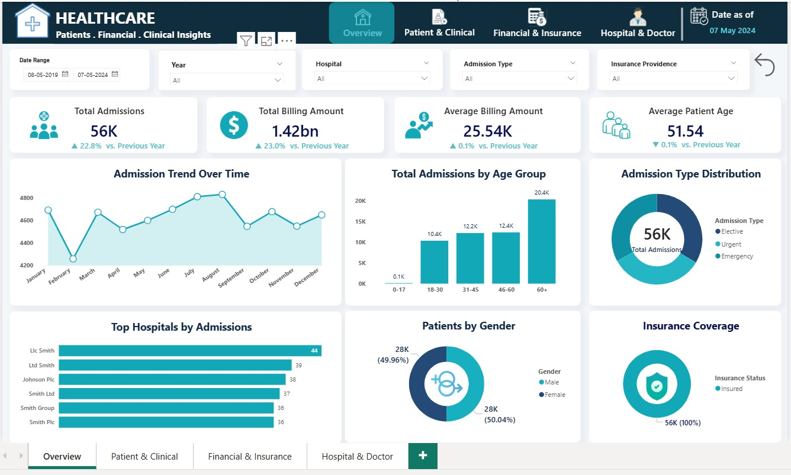
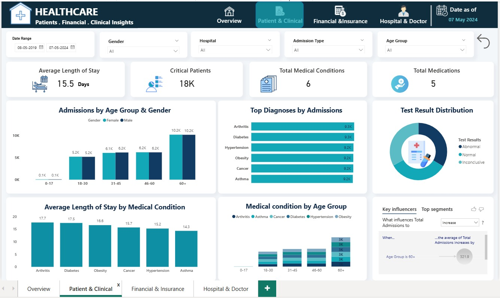
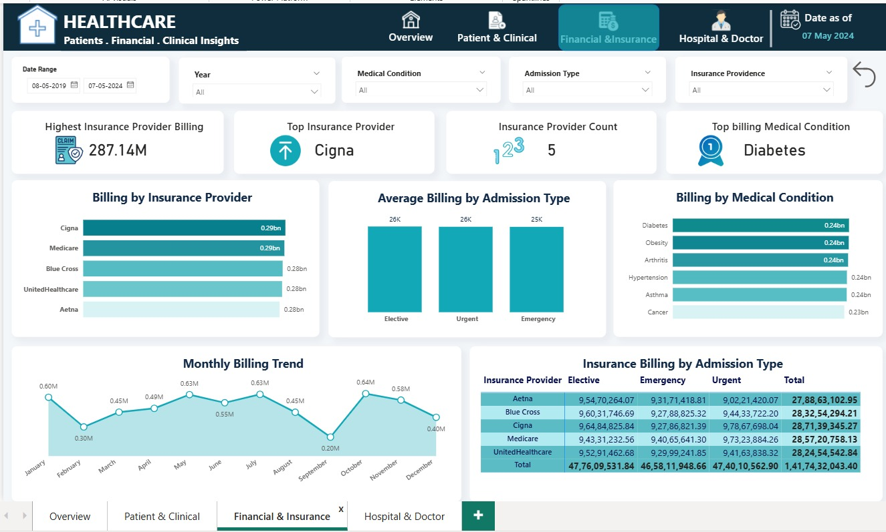
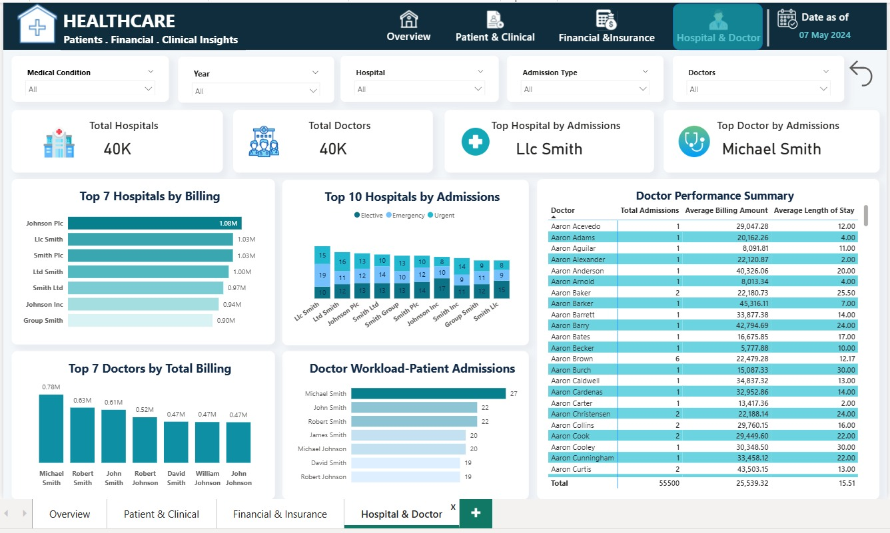

# healthcare-analytics
Healthcare Analytics Dashboard using Power BI
## 📊 Project Overview

Healthcare Analytics is a Power BI dashboard project developed using a healthcare dataset. The project focuses on analyzing patient, hospital, doctor, billing, insurance, and admission-related data.

## 🛠️ Tools & Technologies

- Power BI
- SQL (MySQL)
- Power Query
- DAX
- Excel

## 🗄️ SQL Analysis

The same healthcare dataset was analyzed using MySQL to extract meaningful insights and perform data exploration.

### SQL Concepts Used

- Data filtering and aggregation
- GROUP BY and aggregate functions
- CTEs
- Window Functions
- RANK () and DENSE_RANK ()
- Views
- Stored Procedures
- NULL handling
- Date functions

## 📈 Power BI Dashboard

The cleaned and analyzed data was used to create an interactive Power BI dashboard with KPIs, charts, slicers, and insights.

## 📸 Dashboard Screenshots

### Page 1 – Overview

### Page 2 – Patient & Clinical Analysis

### Page 3 – Finance & Insurance

### Page 4 – Hospital & Doctor Analysis

